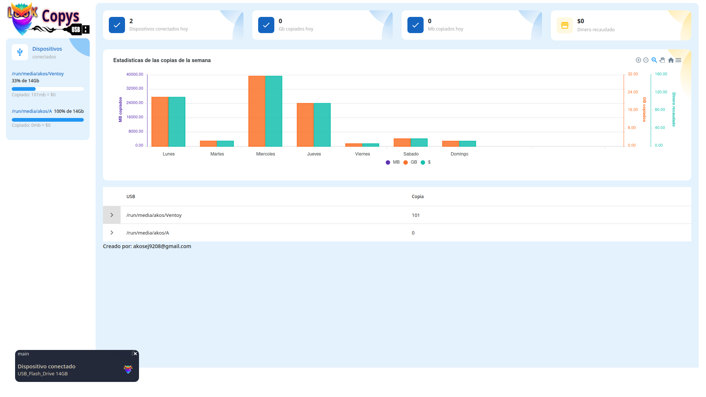

 
# lookcopys 
**Multiplatform application to monitor the copies that are made on USB devices**

>Keeps a record of all connected devices and what has been copied from the PC running the application

## Programming languages used

## Contributors
[@akosej](https://github.com/akosej) [@Nesty92](https://github.com/nesty92)

## Browser Support
At present, we officially aim to support the last two versions of the following browsers:

## Manual compilation
1. Download or clone the repository from [github](https://github.com/akosej/lookcopys).
2. Navigate to the root  directory of the product and run
3. `go mod tidy`
4. `go mod vendor`
5. `CGO_ENABLED=1 GOOS=linux GOARCH=arm64 go build  -a -ldflags "-extldflags '-static' -s -w" -o lookcopys ./*.go`

## Start up
1. Give it execution permission `> chmod +x ./lookcopys`
2. Run the compiled binary `>./lookcopys`
3. Open a browser and enter the url [http://127.0.0.1:5323](http://127.0.0.1:5323)
